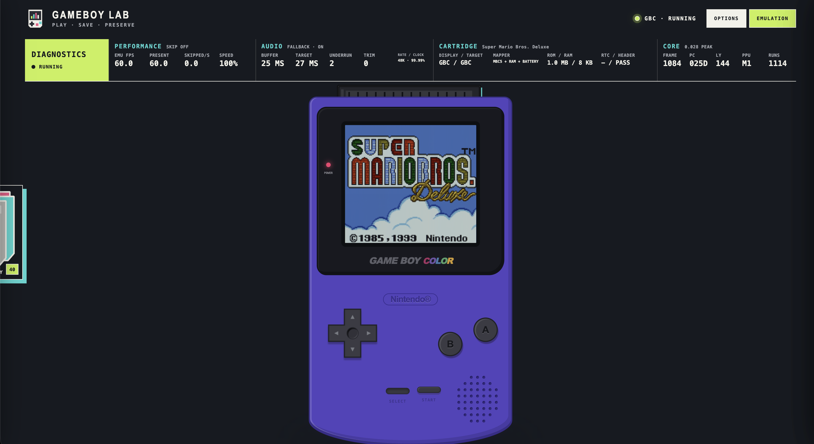

# GAMEBOY LAB

### A complete Game Boy and Game Boy Color emulator in one portable HTML file.

<p align="center">
  
  
  
</p>

Download [`public/gbc-lab.html`](public/gbc-lab.html), open it in a desktop
browser, and play. There is no installer, account, server, or asset folder to
keep beside it. The emulator, interface, local library, LCD renderer, save
tools, and bundled local content all travel together.

## Why GAMEBOY LAB exists

Most emulator frontends either prioritise bare functionality or ask you to
assemble a collection of cores, firmware, shaders, and folders. GAMEBOY LAB is
the opposite: it treats the whole experience as one finished object.

| What you get | What it means while playing |
| --- | --- |
| **One offline file** | Copy one HTML file between your own computers and open it in a current desktop browser. |
| **DMG and GBC hardware views** | Switch between carefully drawn original Game Boy and Game Boy Color shells, or remove the shell for a large screen-only view. |
| **Purpose-built LCD rendering** | Use clean pixels, a dotted DMG response, a colour LCD treatment, independent ghosting, contrast, colour correction, and integer or fractional scaling. |
| **A cartridge library** | Add `.gb` and `.gbc` files once, then search, filter, sort, browse cover art, or spread the collection across a scrollable tabletop. |
| **Physical presentation** | Cartridge insertion, cataloguing, console switching, button presses, drawer movement, and screen transitions are animated as one console interaction. |
| **Clear save tools** | Battery saves, RTC data, and emulator save states are presented separately, with visual previews and a portable all-games backup. |
| **Useful control over latency** | Remap keys, adjust sound and buffering, choose frame presentation behaviour, and inspect the optional live technical readout. |
| **Local by design** | Games, artwork, preferences, and saves stay in the browser on the device running the file. |

## Accuracy and performance

GAMEBOY LAB uses a JavaScript emulation core written for the browser, with CPU,
timer, PPU, APU, DMA, mapper, RTC, serial, infrared, boot-ROM, and save-state
behaviour covered by automated tests. That is the unusual part of the project:
the polished browser interface is built around a real hardware-oriented core,
not a remote service or a native emulator hidden behind a web page.

The comparison below records the pinned v3.0.3 harness. Every strict row uses
the same ROM bytes, matching hardware model, explicit boot policy, cycle limit,
timeout, and pass detector. A missing adapter is reported as unavailable rather
than being turned into a failure.

| Pinned suite | GAMEBOY LAB | SameBoy 1.0.3 | Gambatte-libretro |
| --- | ---: | ---: | ---: |
| SameSuite · 76 non-SGB CGB cases | **60/76 strict** | **65/76 strict** | 8 diagnostic passes · 61 diagnostic fails · 7 unavailable |
| Mooneye acceptance · 70 applicable cases | **70/70 strict** | **70/70 strict** | Not comparable: the required marker is not exposed |
| Mealybug DMG-blob · 24 image cases | **1/24 exact**, 96.03% average structural match | Not scored: no shared frame adapter | Not scored: no shared frame adapter |

On the same Apple M1 Pro laptop, using the same post-boot Tetris workload,
warm-up, frame count, and rotated trial order, the core-only benchmark measured:

- **DMG:** GAMEBOY LAB completed the measured workload **86.9% faster than
  SameBoy**.
- **GBC:** GAMEBOY LAB completed the measured workload **48.4% faster than
  SameBoy**.
- Gambatte's native diagnostic adapter remained **357.8% faster in DMG** and
  **446.1% faster in GBC** than the JavaScript core. That comparison excludes
  GAMEBOY LAB's browser interface, WebGL LCD pass, audio output, and animation.

These figures measure host-side headroom, not game speed—the emulated hardware
still runs at its fixed cadence. They are a reproducible snapshot, not a claim
that any finite suite proves perfect emulation. Case results, hashes, policies,
and adapter limits are documented in
[`docs/accuracy-scorecard.md`](docs/accuracy-scorecard.md), with raw data in
[`release/benchmarks/v3.0.3-summary.json`](release/benchmarks/v3.0.3-summary.json).

## Start playing

1. Download [`public/gbc-lab.html`](public/gbc-lab.html).
2. Open it in a current desktop browser.
3. Open **Library**, choose a cartridge, and press **Play**.

The first button press lets the browser start audio. After that, the emulator
runs entirely from the local file.

### Default controls

| Game Boy control | Key |
| --- | --- |
| D-pad | Arrow keys |
| A | `X` |
| B | `Z` |
| Start | `Enter` |
| Select | `Shift` |

Arrow keys are captured while the emulator is focused, so they do not scroll
the page. Every binding can be changed under **Options → Controls**, and the
physical button motion can be enabled or disabled independently.

## Library and cartridges

The cartridge stack on the left edge opens the library. Detail view is built
for searching and reading game information; Table view lays the collection out
as physical cartridges and lets it continue vertically as the library grows.
Both views share title search, GB/GBC filters, and sorting by title, last played,
or ROM size.

Adding a ROM does not launch it. GAMEBOY LAB first identifies its title, checks
for a duplicate, chooses the correct grey or black cartridge, resolves artwork,
and paints the finished cartridge before shelving it. Loading a different game
uses a hold-to-confirm action when progress could be lost.

## Saves without the usual confusion

Hover the inserted cartridge and open **Save options**.

- A **battery save** is the progress written by the game itself. It can be
  downloaded as a normal `.sav` for compatible cartridges.
- A **save state** freezes the entire emulated machine at one instant. Three
  rotating preview slots show the captured screen and the DMG or GBC model used
  by that state. Overwriting an occupied slot requires a hold.
- **App data** exports every battery save, RTC record, and save-state slot into
  one portable backup. Restore validates the file and asks for confirmation
  before replacing existing records.

## Screen, sound, and presentation

The LCD controls are split into independent choices so one effect never has to
silently enable another:

- **Sharp** displays the source pixels cleanly.
- **LCD** models the visible structure and response of the selected console.
- **Ghosting** controls persistence separately from the pixel treatment.
- **DMG contrast** adjusts the darker production-LCD baseline.
- **GBC colour correction** brings cartridge colours closer to a reflective
  original panel.
- **Integer scaling** maps every 160×144 pixel to a whole-number block. Manual
  scaling is available when a fractional fit is more useful.

Audio has mute, volume, buffering, and filtering controls. Advanced frame-skip
options skip presentation only; CPU, timers, PPU, APU, input, mapper, RTC, and
save processing continue to run.

## Options and Emulation settings

The two drawers have deliberately separate jobs:

- **Options** contains console model, presentation, LCD appearance, sound,
  controls, app behaviour, and complete save backup.
- **Emulation settings** contains scaling, frame presentation, audio latency,
  diagnostics, and timing-facing controls.

Every advanced choice includes a short summary followed by a plain-English
explanation of what changes, what stays accurate, and when the option is useful.

## BIOS, ROMs, and legality

The local build can embed firmware and cartridges supplied by the person
building it. Nintendo firmware and commercial games remain copyrighted; this
project does not grant redistribution rights. Build and share only content you
are legally entitled to use.

## Developer notes

The core and interface are JavaScript, React, CSS, and WebGL. Vite produces the
self-contained [`public/gbc-lab.html`](public/gbc-lab.html); there is no runtime
WebAssembly dependency and no deployment service.

```bash
npm install
npm run dev
npm run lint
npm test
npm run benchmark:core
```

### Benchmark policy

Running a test ROM is not enough to claim a result. SameSuite needs the correct
CGB silicon revision, matching boot image, and a visible marker. Mooneye uses
its own register markers. Mealybug needs a frame-boundary capture. If an adapter
cannot expose the required result, the harness records that limitation rather
than guessing.

The local comparison work covers [SameBoy](https://github.com/LIJI32/SameBoy),
[Gambatte-libretro](https://github.com/libretro/gambatte-libretro),
[mGBA](https://github.com/mgba-emu/mgba), [BGB](https://bgb.bircd.org/index-orig.html),
and [RetroArch](https://www.retroarch.com/) where a frontend/core pair must be
named. Full methodology and unsupported-adapter notes live in the accuracy
scorecard.

### Maintaining releases

Player-facing update text and the developer changelog are intentionally
separate:

1. Put concise player-facing bullets in
   [`release/update-manifest.json`](release/update-manifest.json). The standalone
   file displays these when an update is available.
2. Put implementation details, benchmark methods, caveats, and verification
   commands in `release/vX.Y.Z.md`.
3. Bump `app/version.js`, `package.json`, and the lockfile; build, test, lint,
   verify the standalone asset, then publish the matching version and file.
