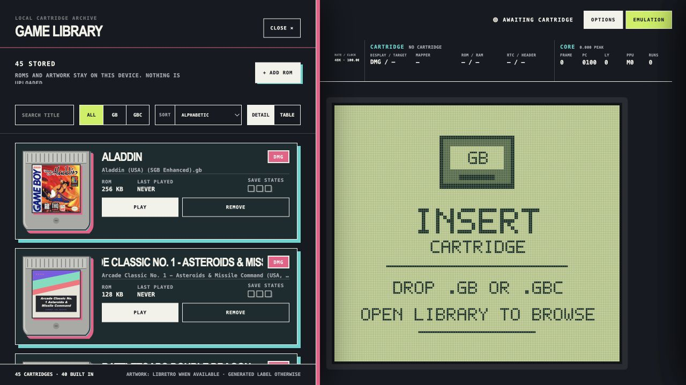
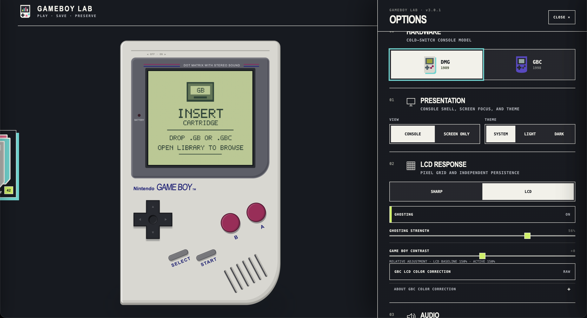
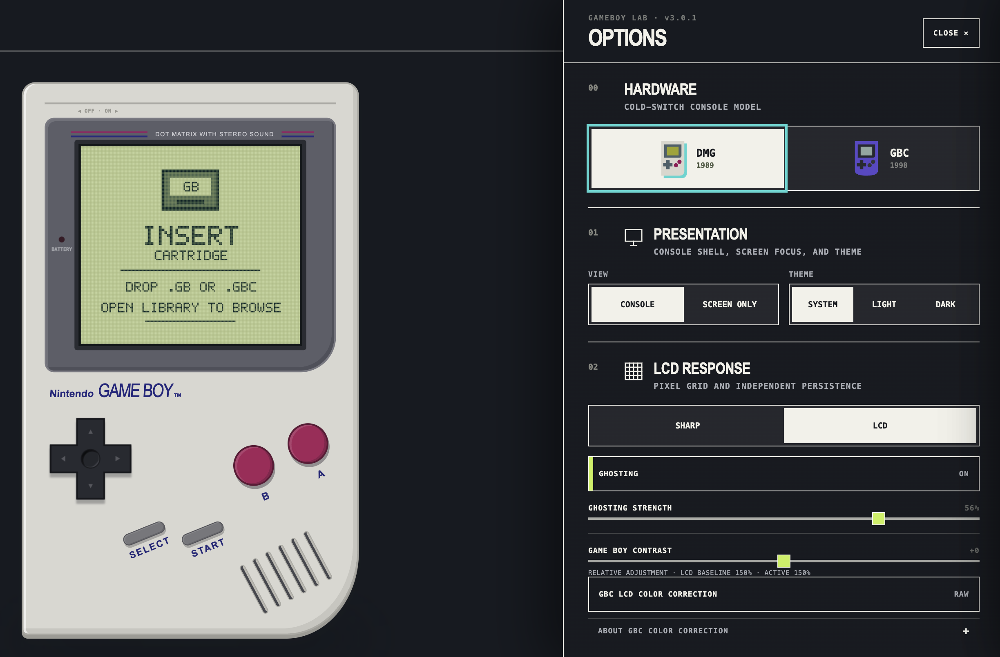

# GAMEBOY LAB

GAMEBOY LAB is an offline Game Boy and Game Boy Color emulator that runs from
one HTML file. It has a local cartridge library, supplied legal BIOS support,
browser saves, save states, LCD filters, and a console view that can be hidden
when you want the screen larger.

## Accuracy snapshot

These numbers come from the same ROM files, ROM hashes, model policy, boot-ROM
policy, cycle budget, timeout, and pass detector. They are test-suite results,
not a claim that a finite suite proves perfect hardware emulation.

| Suite | GAMEBOY LAB | SameBoy 1.0.3 | Gambatte-libretro |
| --- | ---: | ---: | --- |
| SameSuite, 76 non-SGB CGB cases | **60/76 (78.95%)** | **65/76 (85.53%)** | **Not comparable** |
| Mooneye production-model acceptance | **70/70 (100%)** | Not run in this release | Not comparable |
| Mealybug DMG-blob, 24 image cases | **1/24 pixel-exact** | Not run in this release | Not run in this release |

Gambatte was run against all 76 SameSuite ROMs as a diagnostic. It reported
8 byte-level passes, 61 failures, and 7 revision-specific cases that were not
scored. Gambatte exposes a generic CGB mode, not CGB-0/A/B/C/D/E selection, and
its public API does not expose SameSuite's CPU-register completion signature.
Those results must not be presented as a strict accuracy score.

The SameSuite comparison is deliberately conservative: failures, timeouts,
crashes, protocol errors, and unsupported hardware are kept separate. The
remaining GAMEBOY LAB failures are concentrated in revision-sensitive APU
timing fixtures. The detailed case list and commands are in
[`EMULATION_AUDIT.md`](EMULATION_AUDIT.md).

## Start playing

1. Download [`public/gbc-lab.html`](public/gbc-lab.html), or build it locally.
2. Open it in a current desktop browser.
3. Open **Library**, choose a cartridge, and press **Play**.

The build is local-first. Preferences, artwork, BIOS profiles, battery RAM,
RTC data, and snapshots stay in this browser. Use only ROMs and firmware you
are legally allowed to use; Nintendo game software and boot ROMs are not
redistributed by this project.


## What is included

- **DMG and GBC presentation.** Switch console models while keeping the
  emulator core and cartridge state explicit. Monochrome games can use the
  original GBC startup palettes.
- **Screen-only mode.** The live LCD grows into a larger view and returns to
  the console without replacing it with a second, blurry render.
- **LCD controls.** Sharp pixels, a DMG dot-and-gap LCD treatment, a normal GBC
  LCD treatment, and independent ghosting are available in Options.
- **Sizing controls.** Integer scaling keeps source pixels at whole-number
  sizes. Turn it off for the 90% manual default and use the scale slider.
- **Controls and sound.** Arrow keys, X, Z, Enter, and Shift are mapped by
  default. Remapping, button depression, mute, volume, buffering, and frame
  presentation options are available.
- **Cartridge library.** Add legally sourced `.gb` and `.gbc` files, search,
  filter, sort by title/recent use/size, and use detail or tabletop views.
  Artwork and cartridge colour carry into the insertion animation.
- **Saves.** Cartridge saves (`.sav` and RTC data) are separate from three
  emulator save-state slots. Application data can back up both kinds together.



## Controls

| Game Boy control | Default key |
| --- | --- |
| D-pad | Arrow keys |
| A | `X` |
| B | `Z` |
| Start | `Enter` |
| Select | `Shift` |

Arrow keys are captured while the emulator is focused so they do not scroll
the page. Bindings can be changed in **Options → Controls**.

## Saves and backups

Open **Save options** from the cartridge hint above the console.

- A **cartridge save** is progress written by the game to battery-backed RAM;
  it can be downloaded as a portable `.sav` file.
- A **save state** is an emulator snapshot of CPU, video, audio, timers,
  mapper, and cartridge RAM at one instant. It is not an in-game save.
- **Application data** exports cached cartridge saves, RTC data, and all three
  save-state slots in one backup. Restoring it replaces matching local data
  only after a confirmation.

## Options and emulation settings

**Options** contains theme, pause-on-menu, controls, LCD appearance, ghosting,
sound, scale, library layout, and application backup/restore.

**Emulation settings** contains timing and presentation controls: audio buffer
profile, frame presentation skip, and the optional technical readout. The
readout stays on the main screen and reports FPS, skipped frames, audio queue
health, ROM size, mapper, and RTC state when the window is wide enough.





## Firmware and legality

GAMEBOY LAB accepts the legally sourced BIOS profiles placed in the local
`Bios/` directory and embeds the selected profiles in the portable build. The
app does not expose a BIOS uploader or selector. Do not redistribute Nintendo
firmware or game ROMs without the rights to do so.

## For developers

The emulator core and UI are JavaScript/React/CSS. Vite produces the portable
single-file artifact at [`public/gbc-lab.html`](public/gbc-lab.html); there is no
emulator WebAssembly dependency.

```bash
npm install
npm run sync:artwork       # optional local artwork refresh
npm run dev
npm test                   # build plus project tests
npm run lint
npm run benchmark:core
```

The checked-in conformance tools record ROM hashes, suite commits, BIOS hashes,
model/revision selection, cycle budget, timeout, and pass detection. Unknown
CGB suffixes are rejected. SameBoy's adapter is pinned separately from the
browser core. Gambatte's diagnostic adapter is intentionally not accepted by
the strict comparator because it cannot prove the revision/register protocol.

The controlled core-throughput smoke run uses identical ROMs, 120 warm-up
frames, 600 measured frames, and nine rotated-order trials. It excludes DOM,
CSS, shaders, and host audio:

| ROM / model | GAMEBOY LAB | SameBoy 1.0.3 | Gambatte-libretro |
| --- | ---: | ---: | ---: |
| Tetris / DMG | 792.70 FPS | 405.94 FPS | 3,628.48 FPS |
| Tetris DX / CGB | 665.75 FPS | 477.36 FPS | 3,996.78 FPS |

These are host-throughput measurements, not emulated game-speed settings.
Run the benchmark with:

```bash
node scripts/three-way-benchmark.mjs \
  --sameboy-runner /path/to/sameboy-frame-runner \
  --gambatte-runner /path/to/gambatte-runner \
  --gambatte-core /path/to/gambatte_libretro.dylib \
  --frames 600 --warmup 120 --trials 9 \
  --report /tmp/gameboy-lab-three-way.json
```

For a local Gambatte SameSuite diagnostic, build
[`scripts/reference/gambatte-conformance-runner.cpp`](scripts/reference/gambatte-conformance-runner.cpp)
against a pinned Gambatte-libretro checkout, then run:

```bash
DYLD_LIBRARY_PATH=/path/to/gambatte \
node scripts/gambatte-samesuite.mjs \
  --runner /path/to/gambatte-conformance-runner \
  --boot-dir /path/to/boot-roms \
  --suite /path/to/SameSuite \
  --report /tmp/gambatte-samesuite.json
```

## Release notes and maintenance

The app update popup and the GitHub release body are separate on purpose.

1. Maintain the short player-facing text in
   [`release/update-manifest.json`](release/update-manifest.json). Mention what
   changed in games or the UI; include a percentage only when it is backed by
   a reproducible run.
2. Maintain the developer changelog in `release/vX.Y.Z.md`. Put the concise
   summary and measured tables first, followed by method, caveats, and test
   commands.
3. Bump `app/version.js`, `package.json`, and both lockfile version fields;
   build, test, lint, and verify the HTML SHA-256 before publishing.

The manifest is mirrored to the public update endpoint only after the matching
HTML asset exists on GitHub Releases.
