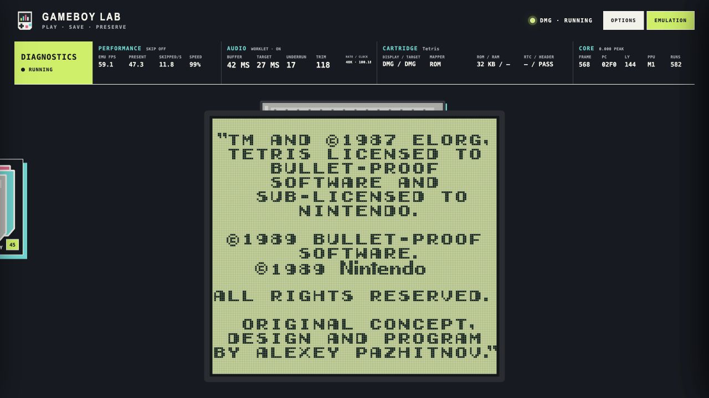
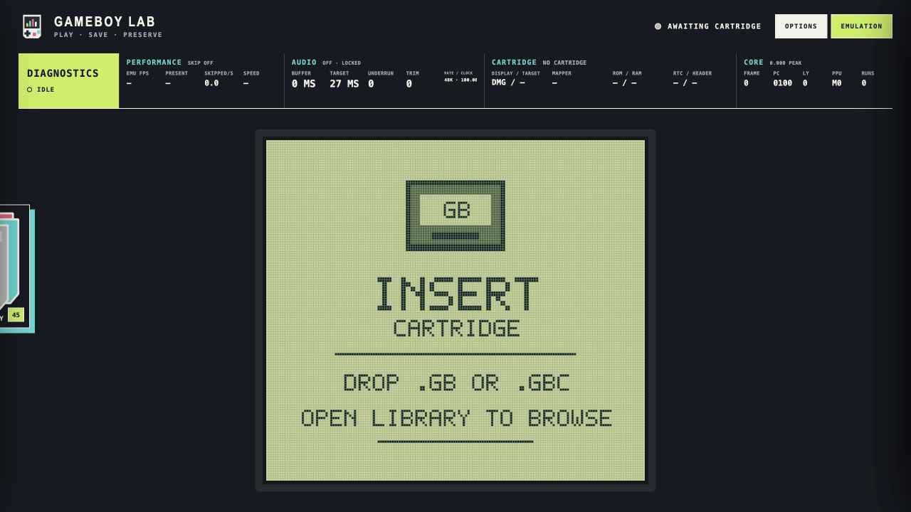

# GAMEBOY LAB

GAMEBOY LAB is a private, offline-first Game Boy and Game Boy Color player for
the browser. Open one local HTML file, choose a cartridge from the library, and
play with the feel of a small, carefully drawn console around the game screen.
There is no account, server, upload step, or online dependency during play.



## Start playing

1. Download or build [`public/gbc-lab.html`](public/gbc-lab.html).
2. Open it in a current desktop browser (Chrome, Edge, Firefox, or Safari).
3. Open **Library**, choose a cartridge, and press **Play**.

The repository includes a small set of legally sourced local cartridges and
artwork for development. Add your own ROMs through the library when you want
to use a different collection. GAMEBOY LAB does not include Nintendo game
software; use only ROMs and firmware you are legally allowed to use.



## The useful bits

- **DMG and GBC modes.** Switch between the original grey Game Boy and the
  Game Boy Color presentation. Compatible monochrome games can use the
  original GBC startup palette combinations.
- **A console that gets out of the way.** Keep the illustrated handheld around
  the LCD, or switch to a large screen-only view. The transition keeps the same
  live LCD rather than replacing it with a second, blurry copy.
- **LCD options that stay readable.** Choose a sharp image, a DMG dot-and-gap
  grid, a normal GBC LCD treatment, and optional ghosting. Ghosting is its own
  control, so it can be used without the grid.
- **Flexible sizing.** Whole-device integer scaling is available when you want
  a crisp, even pixel scale. Turn it off for a 90% starting size and use the
  manual scale control for a more exact fit.
- **Controls that feel physical.** Arrow keys move the D-pad; **X**, **Z**,
  **Enter**, and **Shift** are A, B, Start, and Select. Optional button motion,
  remapping, pointer controls, mute, volume, buffering, and frame-presentation
  choices live in the drawers.
- **Saves that are hard to confuse.** A real cartridge save is the game’s own
  battery-backed progress (`.sav`). A save state is an emulator snapshot of the
  whole machine. Both are kept separately, labelled separately, and can be
  backed up together from the save drawer.
- **A local library.** Filter by GB/GBC, search titles, sort by name, size, or
  recently played, and choose detail cards or a minimal scrollable tabletop.
  Cartridge art and model colour are carried into the insertion animation.
- **Offline by design.** Preferences, battery RAM, RTC data, and snapshots are
  stored in this browser. The one-file build embeds the app, supplied BIOS
  profiles, library metadata, and artwork so it can travel on a USB drive.


## Keyboard controls

| Game Boy control | Default key |
| --- | --- |
| D-pad | Arrow keys |
| A | `X` |
| B | `Z` |
| Start | `Enter` |
| Select | `Shift` |

Arrow-key scrolling is prevented while the emulator has focus. Every binding
can be changed in **Options → Controls** and the current key legend is shown
inside the drawer.

## Saves and backups

Open the cartridge’s **Save options** from the small cartridge hint above the
console. The two save systems are intentionally separate:

- **Cartridge save** is the portable `.sav`/RTC data that a game writes itself.
- **Save states** are three instant snapshots containing CPU, video, audio,
  timers, mapper state, and cartridge RAM at one moment.

The **Application data** section can export all cached cartridge saves and save
states as one backup file. Restoring it replaces matching local data only after
a confirmation. Individual `.sav` files remain available for use in another
emulator.

## Display, sound, and advanced controls

The two drawers keep everyday choices separate from emulation choices:

- **Options** contains theme, pause-on-menu, controls, LCD appearance, scale,
  sound, library view, and application backup/restore.
- **Emulation settings** contains timing and presentation controls for people
  who need them: audio buffering profiles, frame presentation skip, and the
  optional technical readout.

The technical readout is deliberately off the game by default. When enabled
on a wide enough window it reports emulated and presented FPS, skipped frames,
audio queue health, cartridge details, ROM size, and RTC state. It is a monitor,
not a requirement for playing.

## Firmware and legality

GAMEBOY LAB can run with a supplied legal startup BIOS. Production DMG/GBC
firmware and maintainer-only diagnostic profiles are embedded in the build;
the app does not expose a BIOS picker or an upload field. Do not redistribute
Nintendo firmware or game ROMs without the rights to do so.

## Troubleshooting

- **The file opens but audio is silent:** click once in the page, then unmute
  in Options. Browsers require a user gesture before audio can start.
- **A game is too large or too small:** turn off integer scaling and adjust the
  manual scale slider; the reset button returns to the default 90% size.
- **A battery game starts without its progress:** open Save options and import
  its `.sav`, or restore an application-data backup made by GAMEBOY LAB.
- **The library is empty:** open Library and add a legally sourced `.gb` or
  `.gbc` file. It will be identified, given a model colour, and added without
  replacing the currently running cartridge.

## For developers

The source is a from-scratch JavaScript core with a single-file Vite build.
There is no emulator WebAssembly dependency. The public artifact is generated
from `app/` and `src/`-free React/CSS UI modules into
[`public/gbc-lab.html`](public/gbc-lab.html).

```bash
npm install
npm run sync:artwork       # optional: refresh the local Libretro artwork cache
npm run dev
npm test                   # builds the portable file, then runs the full suite
npm run lint
npm run benchmark:core
```

The conformance tools accept locally supplied test-suite and BIOS directories.
They record ROM hashes, BIOS hashes and sizes, model/revision selection, cycle
budget, timeout/crash status, and pass-detection protocol. Unknown CGB
revisions are rejected rather than silently becoming CGB-E. The current
controlled SameSuite checkout has 76 non-SGB ROMs: GAMEBOY LAB records 60/76
and SameBoy 1.0.3 records 65/76 under the same explicit matrix. Those are
observed suite results, not a claim that either core is “more accurate”; the
remaining cases are revision-sensitive APU fixtures and are retained for the
next accuracy pass.

The reproducible native throughput smoke comparison uses the same two ROMs,
120 warm-up frames, 600 measured frames, nine rotated-order trials, and a
post-boot baseline for all three backends. It excludes DOM, CSS, shaders, and
host audio so it measures core execution plus framebuffer delivery only. On
the audit machine the medians were:

| ROM / model | GAMEBOY LAB | SameBoy 1.0.3 | Gambatte-libretro |
| --- | ---: | ---: | ---: |
| Tetris / DMG | 792.70 FPS | 405.94 FPS | 3,628.48 FPS |
| Tetris DX / CGB | 665.75 FPS | 477.36 FPS | 3,996.78 FPS |

Nine-trial p10–p90 spreads were 625.15–822.60 FPS for LAB DMG and
577.73–741.97 FPS for LAB CGB. Every backend produced a stable per-run
framebuffer hash, but hashes are not compared across cores because colour
encoding and post-boot state differ. Run the harness with:

```bash
node scripts/three-way-benchmark.mjs \
  --sameboy-runner /path/to/sameboy-frame-runner \
  --gambatte-runner /path/to/gambatte-runner \
  --gambatte-core /path/to/gambatte_libretro.dylib \
  --frames 600 --warmup 120 --trials 9 \
  --report /tmp/gameboy-lab-three-way.json
```

The full methodology, suite provenance, known failures, and intentionally
unclaimed comparisons are in [`EMULATION_AUDIT.md`](EMULATION_AUDIT.md).
The exact machine-readable smoke result is checked in at
[`release/benchmarks/v3.0.1-three-way.json`](release/benchmarks/v3.0.1-three-way.json).
Release-specific engineering notes live in [`release/`](release/); the app’s
short, player-facing update text is maintained separately in
[`release/update-manifest.json`](release/update-manifest.json) and mirrored to
the public manifest used by `app/version.js`.

## Release maintenance

Keep the two changelogs independent:

1. `release/update-manifest.json` is the six-line, plain-language note shown in
   the app. Say what a player will notice and include a measured percentage
   only when the comparison is reproducible.
2. `release/vX.Y.Z.md` is the developer-facing GitHub release body. Put the
   nuanced engineering summary and tables at the top, then methodology,
   caveats, and test commands.

For a release, bump `app/version.js`, `package.json`, and the two package-lock
version fields; run `npm test`, `npm run lint`, and `git diff --check`; commit
the built `public/gbc-lab.html`; create and push the matching tag; upload the
same HTML file to GitHub Releases; verify its SHA-256; then mirror the manifest
to the public Gist. The manifest must never advertise a download before that
asset exists.
